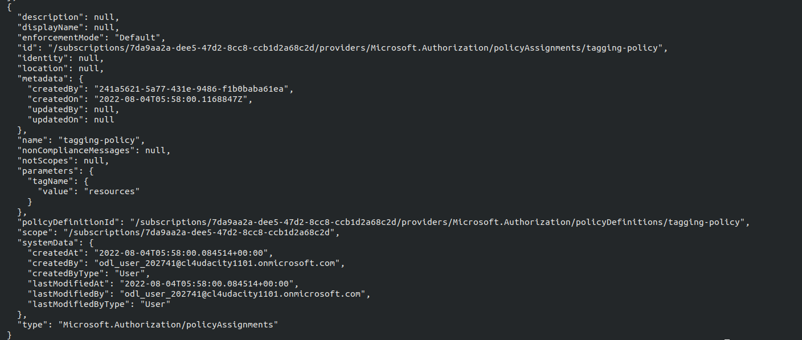
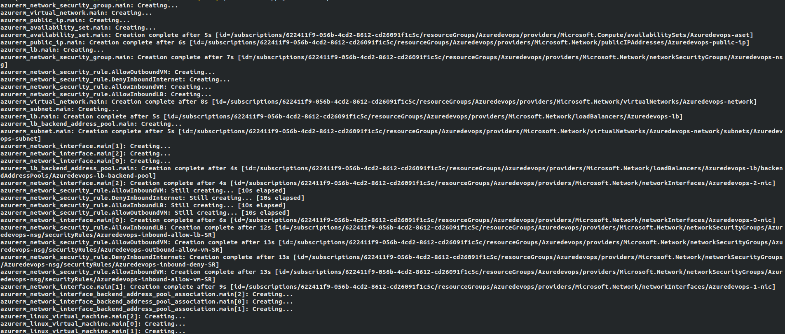
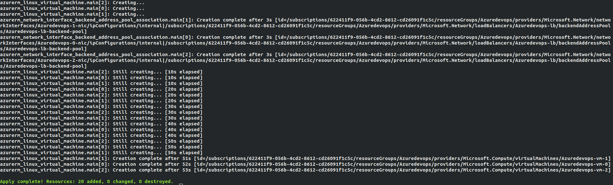
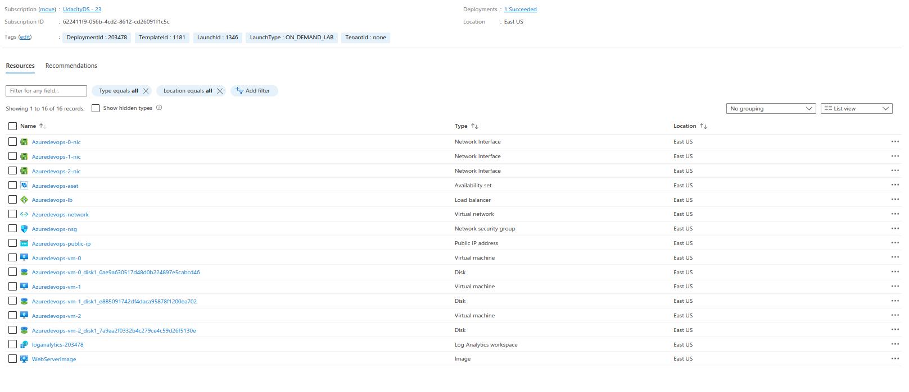

# Azure Infrastructure Operations Project: Deploying a scalable IaaS web server in Azure

### Introduction
For this project, you will write a Packer template and a Terraform template to deploy a customizable, scalable web server in Azure.

### Getting Started
1. Clone this repository

2. Install all the dependencies mentioned below in Dependencies section

3. Export necessary variables for terraform
   * export ARM_CLIENT_ID=xxxxxxxxxxx
   * export ARM_CLIENT_SECRET=xxxxxxxxxxxx
   * export ARM_SUBSCRIPTION_ID=xxxxxxxxxxxx
   * export ARM_TENANT_ID=xxxxxxxxxxxxxx

### Dependencies
1. Create an [Azure Account](https://portal.azure.com) 
2. Install the [Azure command line interface](https://docs.microsoft.com/en-us/cli/azure/install-azure-cli?view=azure-cli-latest)
3. Install [Packer](https://www.packer.io/downloads)
4. Install [Terraform](https://www.terraform.io/downloads.html)

### Instructions
1. Use Azure CLI to log in
``` bash
az login
```

2. Create and assign the policy to the subscription. Create a tagging policy with the variable tagName, so all the resources with similar tagNames are created for ease
``` bash
az policy definition create --name tagging-policy --rules tagging-policy.rules.json --params tagging-policy.params.json
```

``` bash
az policy assignment create --name tagging-policy --scope '/subscriptions/xxxxxxxx-xxxx-xxxx-xxxx-xxxxxxxxxxxx' --policy tagging-policy -p "{ \"tagName\": {\"value\": \"resources\"}}"'
```

3. Try assignment list to visualize all the available policy assignment to the subscriptions
``` bash
az policy assignment list
```

4. Create a packer template and build the image. The template is from server.json
``` bash
packer build server.json
```

5. Run the infrastructure as code from terraform template. All the variables are stored in vars.tf, one can chnage if necessary. Variables like username, password, resource group, number of vms need to be created, necessary credentials, etc can be modified.
``` bash
#Initialize the environment
terraform init
#Plan the environment and save the plan
terraform plan -out solution.plan 
#If personal azure account is used, then infrastructure can be created
terraform apply
#To destroy the resources created
terraform destroy
```

### Output
Output of policy assignment, packer output and transformer output can be seen below







vars.tf can be used for modifying the variable for creating the infrastructure. One can change the number of Virtual machines, resource group, necessary id's in vars.tf easily and create infrastructure. 